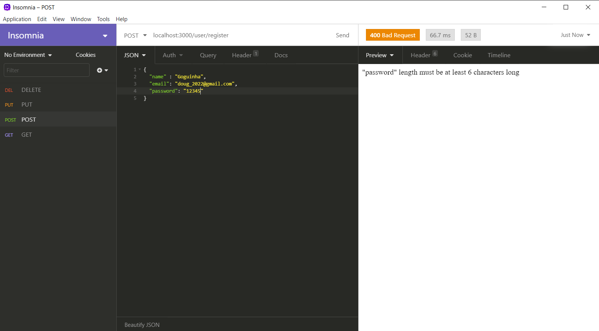
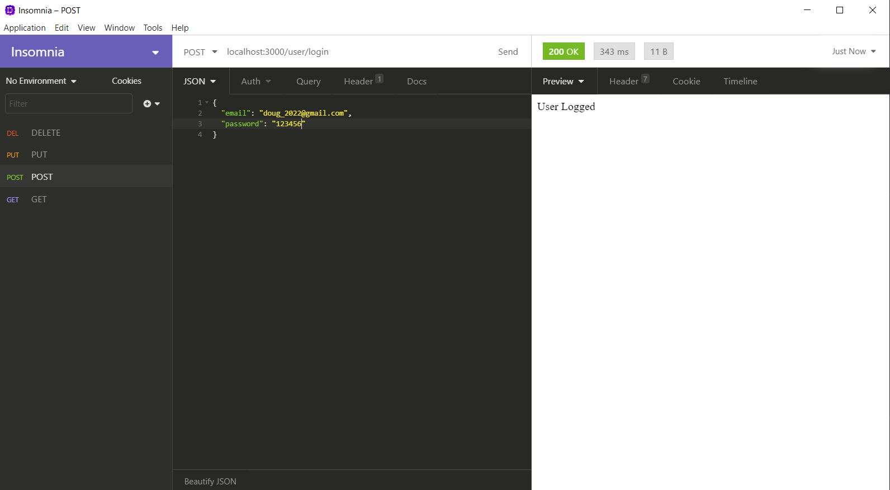
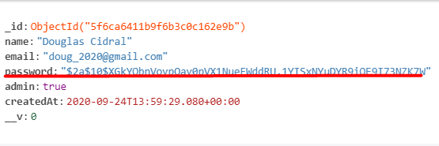
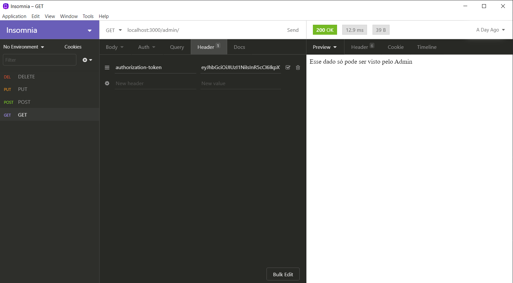
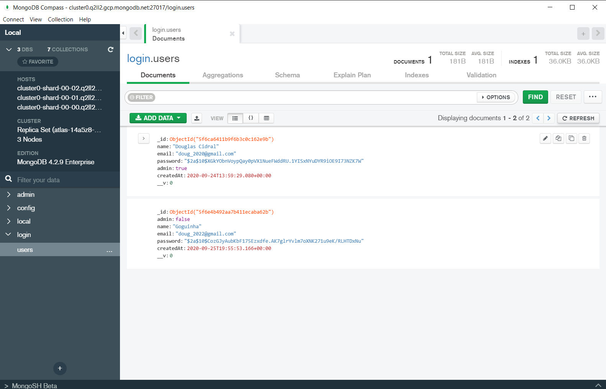

# API REST para Login

Esta é uma aplicação Back-End de Login utilizando Node.Js e MongoDb.

---

É possível registrar novos usuários desde que os dados passem na validação de mínimo e máximo de caracteres.

* Para o 'name' e o 'email' a regra é min: 3 e max: 50;
* Para o 'password' a regra é min: 6 e max: 200;

Caso o novo registro não siga a regra, aparecerá uma mensagem de erro alertando o usuário sobre o que está errado.

---

Para fazer o login o usuário precisará apenas do 'email' e do 'password'.

---

O 'password' é criptografado utilizando o módulo 'bcryptjs'.

---

Essa aplicação também análisa se o usuário logado é um admin fazendo uso do Token em uma requisição GET.

---

## MongoDb

